# Campaign 052 visual acceptance packet

This is the observation-only visual evidence packet for the current Signal Arcade release. It is intended to be reviewed from GitHub by a later ChatGPT session. The images are direct emulator captures of the installed release APK, resized to approximately 540 px wide JPEGs without cropping product content.

## Review basis

| Item | Exact value |
| --- | --- |
| Product/source SHA reviewed | `fe5757b9b7c280652b424e98fe764c9dbc2a2c28` |
| Release APK | `apps/mobile/android/app/build/outputs/apk/release/app-release.apk` |
| Release APK SHA-256 | `C91389622D7D90B58065550FC1F28A30D0086103D99A5956FDEA501667806A4C` |
| Starting repository SHA | `ea6d8777e0bde1eeeec673d9137d4e9463d0b985` |
| Device | `braintraining-ui35`, `emulator-5554`, Android 15 / API 35 |
| Capture profile | 1080×2400 physical pixels, density 420, font scale 1.0 |
| Capture method | ADB + UIAutomator on the dedicated emulator; visible product controls only |

The source SHA is the last commit that changed product code. The repository commits after it were documentation/evidence-only, and the product source tree was verified unchanged. Campaign 052 did not modify product source, themes, components, dependencies, tests, gameplay, persistence, or backend logic.

## Primary screenshots

### Home / Today

[Open `home-today.jpg`](screens/home-today.jpg)

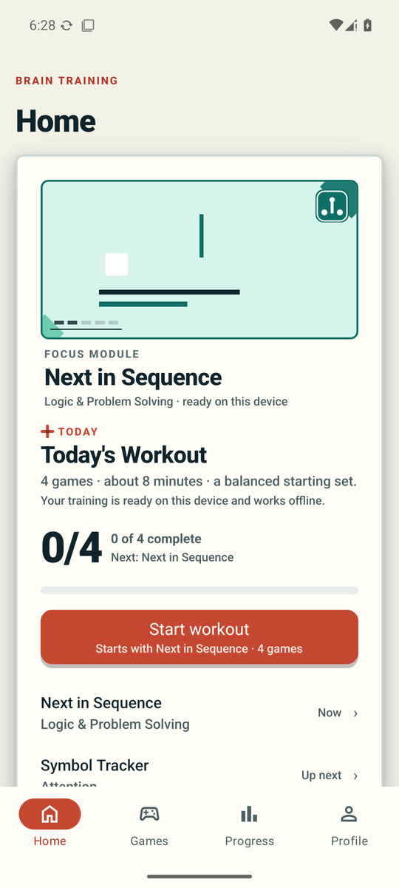

### Games discovery

[Open `games-discovery.jpg`](screens/games-discovery.jpg)

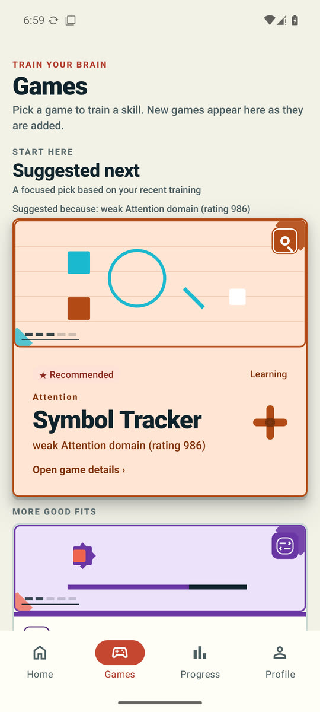

### Game Detail

[Open `game-detail.jpg`](screens/game-detail.jpg)

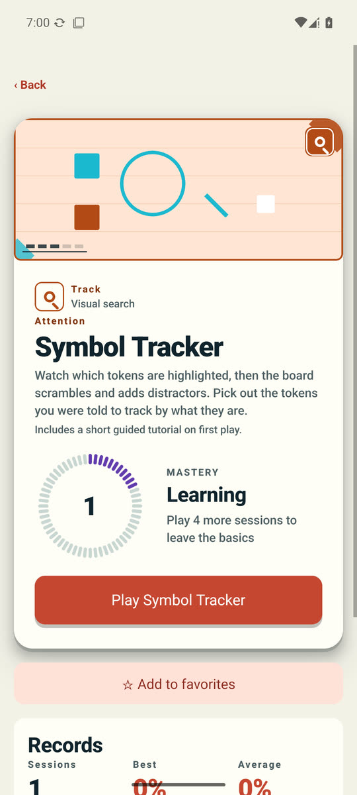

### Active gameplay

[Open `active-gameplay.jpg`](screens/active-gameplay.jpg)

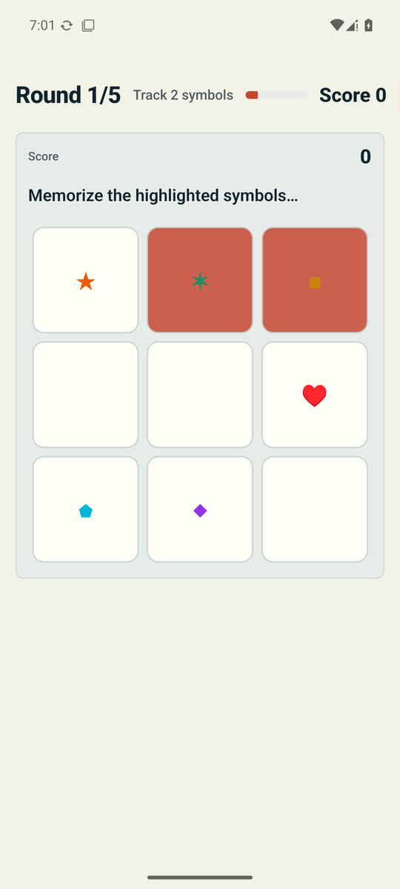

### Result

[Open `result.jpg`](screens/result.jpg)

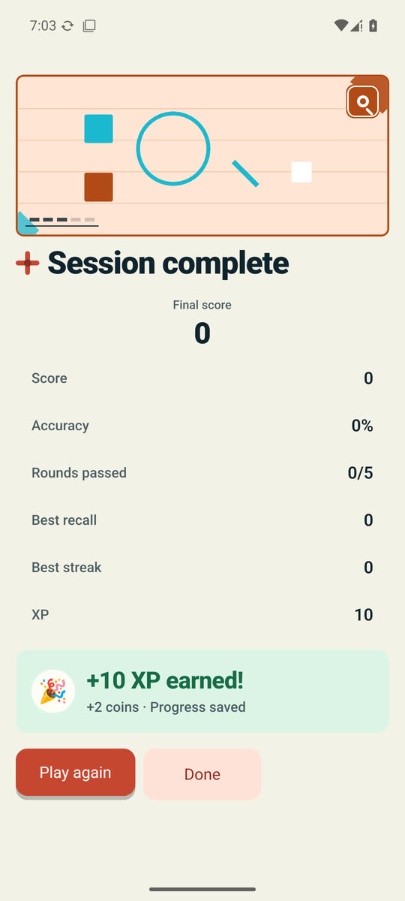

### Progress

[Open `progress.jpg`](screens/progress.jpg)

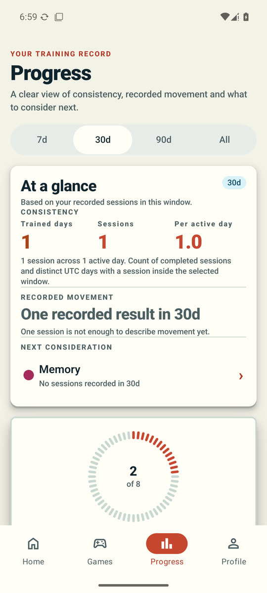

### Profile

[Open `profile.jpg`](screens/profile.jpg)

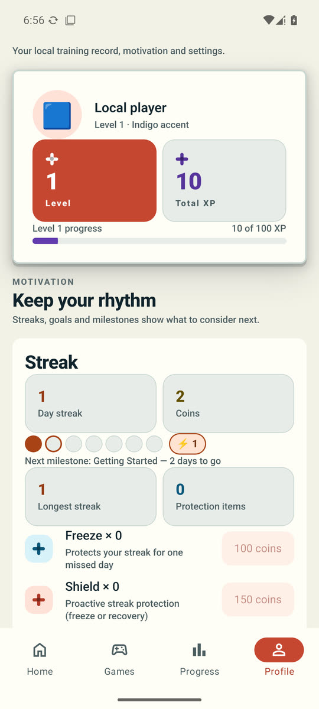

### Rewards

[Open `rewards.jpg`](screens/rewards.jpg)

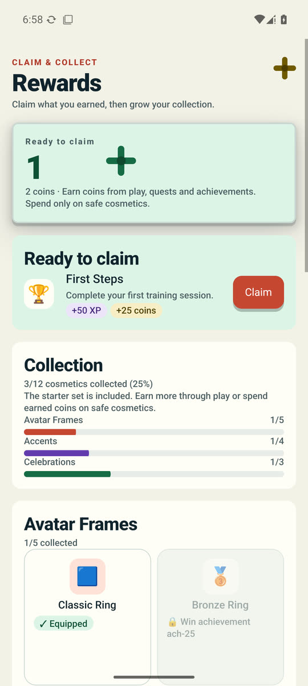

## Supplementary current states

- [Completed Home](screens/home-completed.jpg)
- [Final workout completion](screens/workout-complete.jpg)
- [Games search/filter state](screens/games-search-filtered.jpg)
- [Dark-mode Home](screens/dark-home.jpg)
- [Dark-mode Games](screens/dark-games.jpg)
- [Dark-mode Game Detail](screens/dark-game-detail.jpg)
- [Dark-mode Result](screens/dark-result.jpg)

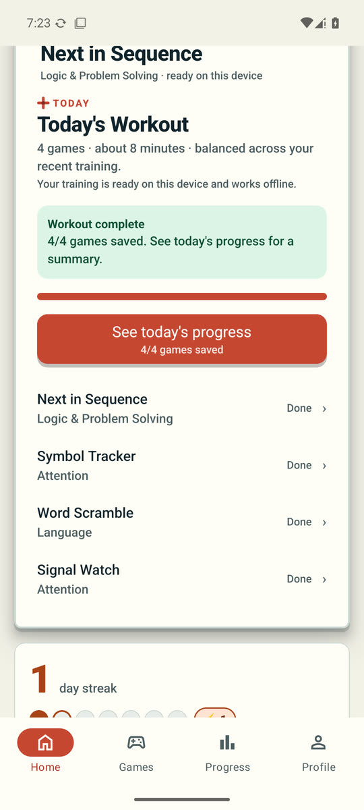

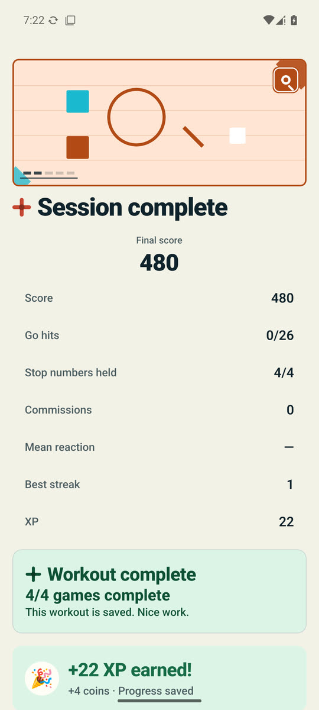

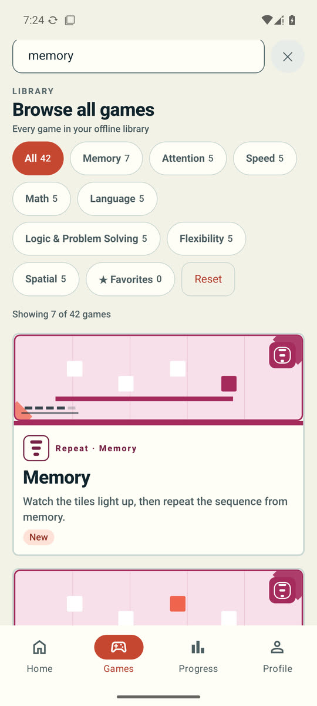

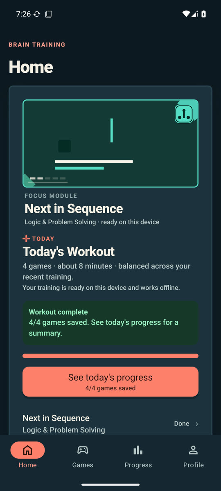

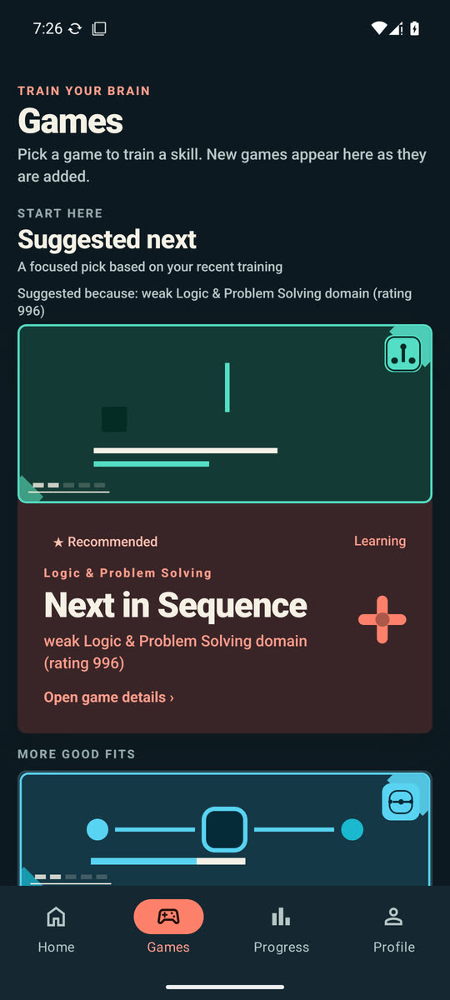

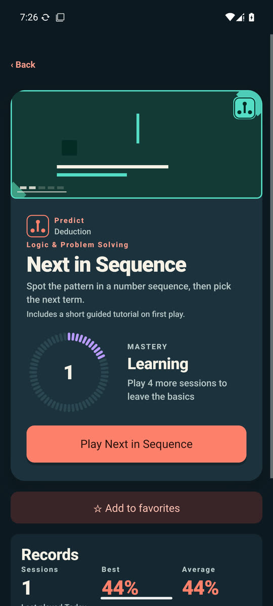

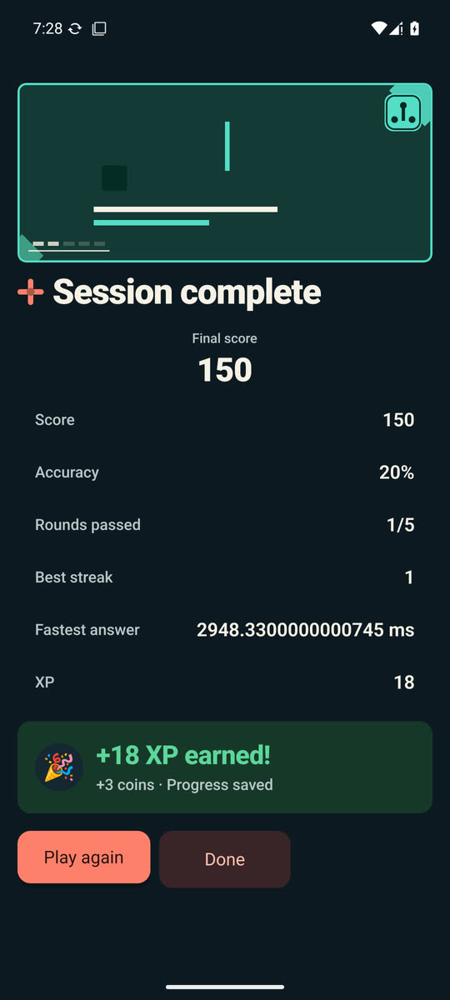

## Contact sheets

- [Primary contact sheet](contact-sheet-primary.jpg) — eight labeled primary screenshots.
- [Preview contact sheet](contact-sheet-preview.jpg) — connector-friendly reduced preview.

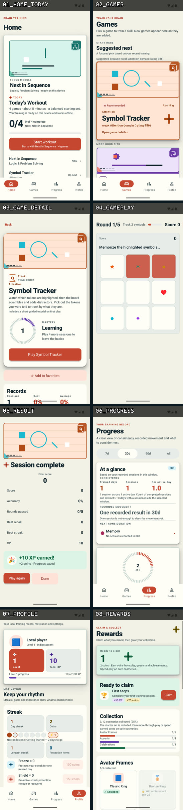

## Review documents

- [Visual review manifest](VISUAL_REVIEW_MANIFEST.md)
- [First-impression review](FIRST_IMPRESSION_REVIEW.md)
- [Independent visual critique](INDEPENDENT_VISUAL_CRITIQUE.md)
- [Reference reality check](REFERENCE_REALITY_CHECK.md)
- [Visual debt map](VISUAL_DEBT_MAP.md)
- [Authoritative Campaign 052 prompt](../../../../.agent/CAMPAIGN052_VISUAL_ACCEPTANCE_REVIEW_PROMPT.md)

This packet records what the current product actually looked and felt like during use. It is not a redesign proposal and does not begin Campaign 053.
